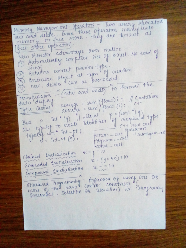
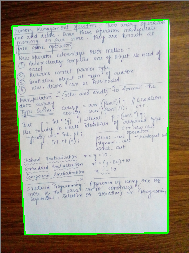

# DocumentScanner
My first openCV project - a personal document scanner !!
The document scanner performs image manipulation in 3 steps -
Finding the edges
Finding the contours of the paper
Applying perspective transform-to obtain top-down view of the image

